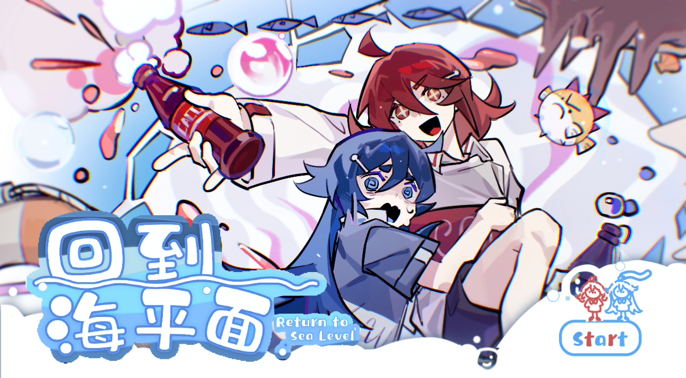
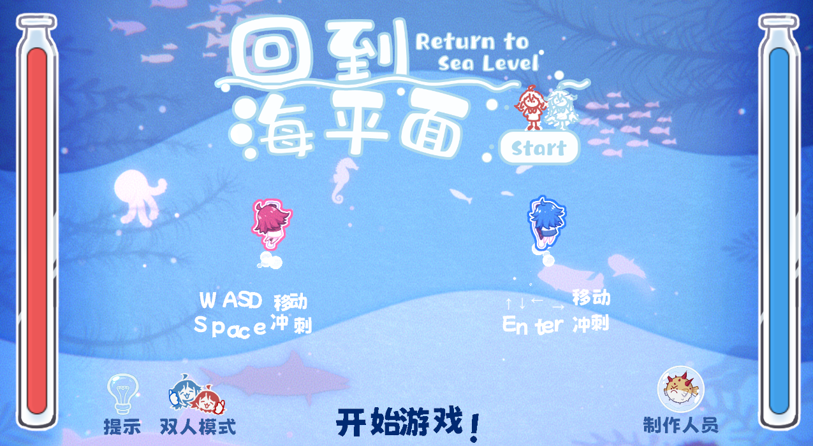
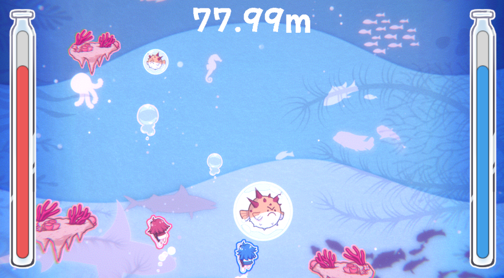
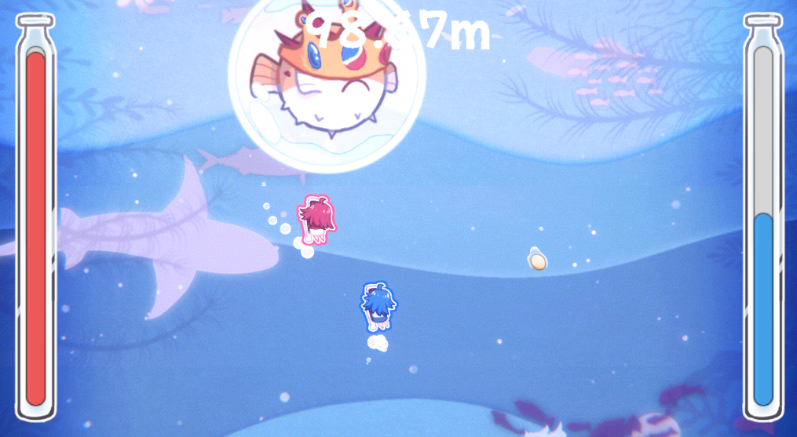

## 简介 Introduction
《回到海平面》是一款单人/本地双人动作游戏，玩家将控制可乐瓶在充满挑战的大海中冒险。通过冲刺释放气泡摧毁障碍物，亦或是利用气泡来保护自己。自己游玩，或与朋友配合，一起克服各种困难，向海平面进发！

Return to Sea Level is a single-player/local multiplayer action game where players control a soda bottle on an adventurous journey through a challenging ocean. Dash to release bubbles that destroy obstacles or use the bubbles to protect yourself. Play solo or team up with a friend to overcome various challenges and head towards the sea level!

## 操作 Controls
玩家1：WASD移动，Space冲刺&攻击；玩家2：↑↓←→移动，Enter冲刺&攻击

Player 1: WASD to move, Space to dash & attack; Player 2: ↑↓←→ to move, Enter to dash & attack

## 开发者 Creators
程策-以，程策-谁家大电视，策美-秋辰子，美术-森因，美术-谭欣然，美术-黄油
